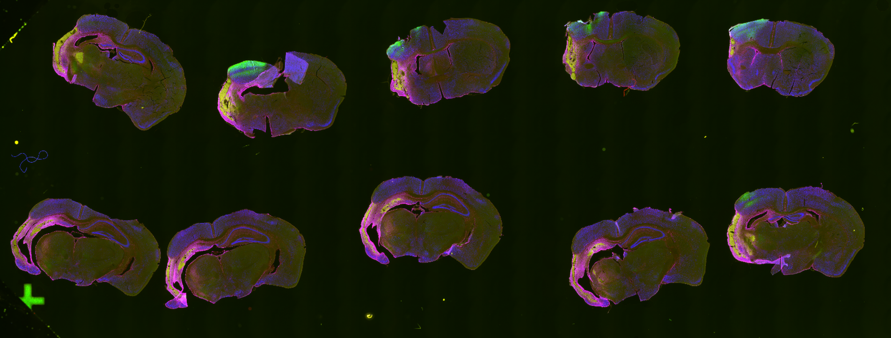
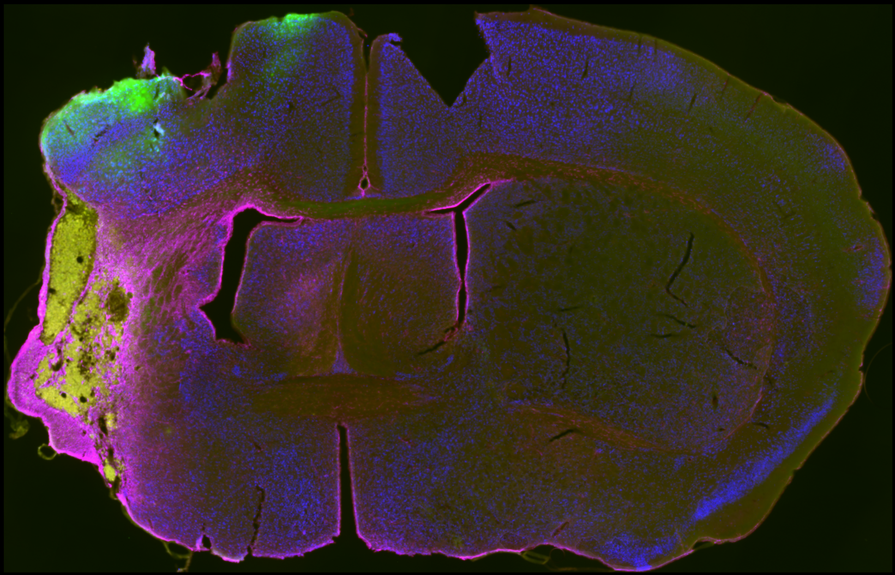
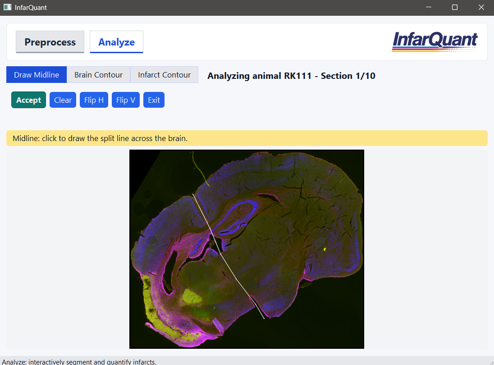
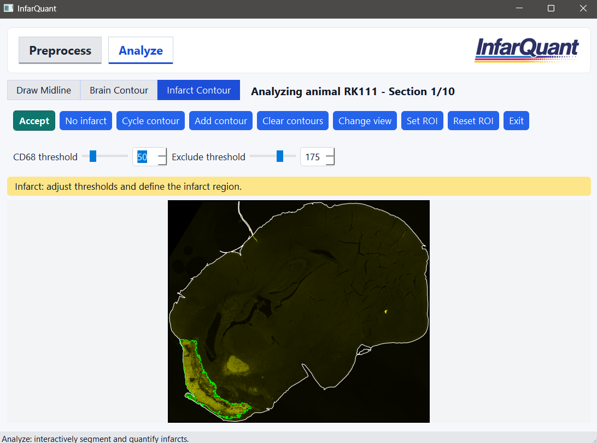
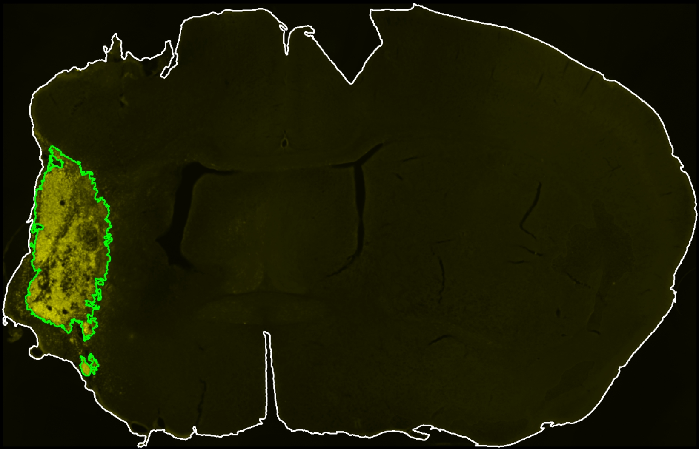
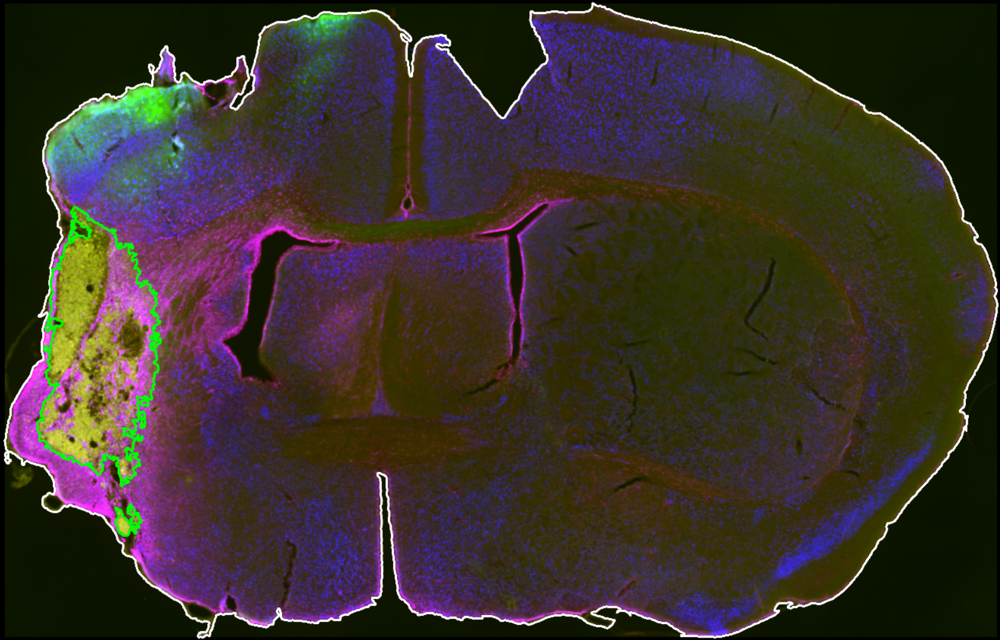

InfarQuant is a desktop GUI for immunohistochemistry (IHC) infarct analysis.
It supports:

- section preprocessing from whole-slide images
- interactive midline and contour-based segmentation
- ROI-assisted infarct quantification
- CSV and image export for downstream analysis

## Highlights

- GUI workflow
- Preprocess + Analyze tabs in one app
- Interactive controls for:
  - midline drawing
  - brain contour threshold
  - CD68 threshold and exclusion channel threshold
  - optional fixed ROI / pre-drawn ROI support

## Screenshots

<table>
  <tr>
    <td></td>
    <td></td>
  </tr>
  <tr>
    <td align="center"><b>Starting Slide</b></td>
    <td align="center"><b>Individual Section Review</b></td>
  </tr>
  <tr>
    <td></td>
    <td></td>
  </tr>
  <tr>
    <td align="center"><b>Draw Midline</b></td>
    <td align="center"><b>Add / Refine Contours</b></td>
  </tr>
  <tr>
    <td></td>
    <td></td>
  </tr>
  <tr>
    <td align="center"><b>Final Infarct Output</b></td>
    <td align="center"><b>Final Merge Output</b></td>
  </tr>
</table>

## Repository Layout

```text
src/infarquant/
  app.py           # GUI launcher
  ui.py            # PyQt UI and workspace interactions
  preprocess.py    # preprocessing pipeline
  analysis.py      # analysis pipeline

tests/             # pytest suite

docs/              # logo + screenshots for README
sample-data/       # example input + example outputs
```


## Requirements

- Python 3.10+
- Windows/macOS/Linux
- Conda recommended for environment management


## Quick Start (Conda Recommended)

```bash
conda create -n infarquant python=3.10 -y
conda activate infarquant
python -m pip install -e .
```

Launch the app:

```bash
python -m infarquant
```

You can also run via script entry point after install:

```bash
infarquant
```

## How to use

1. Open app -> `Preprocess` tab.
2. Select your raw slide folder.
3. Set keywords and thresholds.
4. Run preprocessing to create `preprocessed_sections/`.
5. Open `Analyze` tab.
6. Follow analysis instructions.
7. Save and view results in `preprocessed_sections/results`.

## Outputs

Preprocessing outputs:

- `preprocessed_sections/<animal_id>/<animal_id>_reference_<n>.tif`
- `preprocessed_sections/<animal_id>/<animal_id>_infarct_<n>.tif`
- `preprocessed_detect_<color>.csv`

Analysis outputs:

- `results_detect_<...>.csv`
- segmented output images saved under per-animal `results/` folders

## Sample Data

See `sample-data/README.md` for exact contents and a quick demo workflow.


Confirm environment and install:

```bash
conda activate infarquant
python -m pip install -e .
python -m infarquant
```

## License

MIT. See `LICENSE`.
